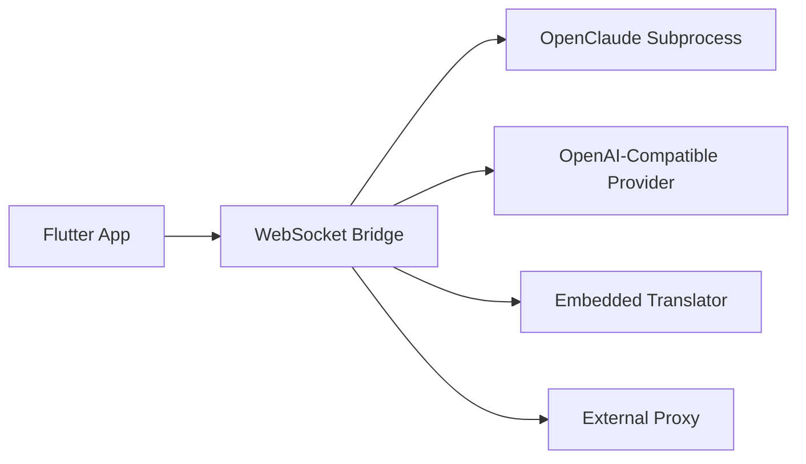

# CCPocket Universal

[](apps/mobile)
[](packages/bridge)
[](LICENSE)
[](https://github.com/sam22ir/CCPocket-universal)

Mobile-first AI coding assistant workspace built with Flutter and a local TypeScript bridge.

`CCPocket Universal` lets you manage coding sessions from your phone while the real assistant runtime stays on your machine. The app talks to a local bridge over WebSocket, and the bridge can either run `OpenClaude`, call OpenAI-compatible providers directly, or expose an embedded translator layer for Anthropic-compatible clients.

## At A Glance

| Part | Stack | Responsibility |
| --- | --- | --- |
| Mobile app | Flutter, Riverpod, Hive | Project list, session history, chat UI, settings |
| Bridge | TypeScript, WebSocket, Node | Session orchestration, providers, translator, proxy |
| Runtime target | OpenClaude or OpenAI-compatible APIs | Actual coding assistant execution |

## Highlights

- mobile control surface for a desktop/local coding assistant
- project-scoped chat sessions with persistent history
- provider and model switching from the app UI
- tool approval flow for safer remote operation
- embedded translator and optional proxy workflows
- remote bridge visibility through tailscale status
- local export of project/session data

## Why This Exists

Most coding assistants assume you are sitting at the same desktop that runs the agent.

This project pushes that model into a mobile workflow:

- browse and manage projects from a phone
- open session history per project
- send prompts to a local coding assistant runtime
- approve or reject tool calls from the mobile UI
- switch providers and models without rebuilding the app
- monitor bridge, proxy, translator, and tailscale state from one place

## What The App Does

At a high level, the repository contains two apps that work together.

### `apps/mobile`

Flutter client for:

- project management
- session history
- chat UI
- tool approval flow
- settings and provider selection
- local export of sessions and projects

### `packages/bridge`

TypeScript bridge server for:

- WebSocket API used by the mobile app
- spawning `OpenClaude` with the right working directory
- direct OpenAI-compatible provider calls
- embedded Anthropic-to-OpenAI translator mode
- optional external proxy management
- project persistence and `CLAUDE.md` handling

## How It Works

```text
Flutter mobile app
  -> WebSocket JSON protocol
TypeScript bridge
  -> OpenClaude subprocess
  -> OpenAI-compatible APIs
  -> Embedded translator / proxy
```

Typical flow:

1. You create or link a project in the mobile app.
2. The bridge associates that project with a real folder on disk.
3. The app opens a chat session for that project.
4. The bridge starts an assistant session with that folder as the working directory.
5. Streaming assistant output is sent back to Flutter over WebSocket.
6. If a tool needs approval, the phone shows a tool card and waits for your decision.

## Product Flow



## Main Features

- Flutter mobile app with Arabic-first UI and session browsing
- local bridge connection with reconnect logic
- project-scoped sessions and persistent message history
- tool-call approval and rejection from mobile
- provider switching for NIM, OpenAI, Gemini, Anthropic, Ollama, and custom OpenAI-compatible endpoints
- embedded translator controls in the settings screen
- proxy controls in the settings screen
- tailscale status card for remote bridge access
- export to Markdown and JSON
- release APK build already working locally

## Repository Layout

```text
.
|- apps/
|  \- mobile/        Flutter client
|- packages/
|  \- bridge/        TypeScript bridge server
|- docs/             Architecture and protocol notes
|- run_app.bat       Local convenience launcher
```

## Architecture Notes

The Flutter app is feature-organized:

```text
apps/mobile/lib/
  core/
    providers/
    router/
    services/
    theme/
  features/
    chat/
    projects/
    sessions/
    settings/
```

The bridge runtime lives in `packages/bridge/src/`:

- `server.ts`: WebSocket entrypoint and message routing
- `session.ts`: session state, provider routing, streaming
- `process.ts`: subprocess management for `OpenClaude`
- `project.ts`: bridge-side project storage and instructions management
- `proxy.ts`: external proxy management
- `translator.ts`: embedded translator server
- `providers/index.ts`: provider registry and validation

## Quick Start

### 1. Start the bridge

```bash
cd packages/bridge
npm install
copy bridge.config.example.json bridge.config.json
```

Edit `bridge.config.json` and add your local provider keys.

Then run:

```bash
npm run dev
```

### 2. Run the mobile app

```bash
cd apps/mobile
flutter pub get
flutter run
```

By default, the app expects the bridge at `ws://localhost:8765`.

## Build

Android release APK:

```bash
cd apps/mobile
flutter build apk --release
```

Expected output:

```text
apps/mobile/build/app/outputs/flutter-apk/app-release.apk
```

## Current State

- Flutter analyzer: clean
- Bridge TypeScript compile: clean
- Android release APK: builds successfully
- GitHub repo: public

## Good First Places To Read

- `README.md`: product overview and setup
- `docs/architecture.md`: runtime structure and persistence model
- `docs/api-protocol.md`: WebSocket message protocol
- `apps/mobile/lib/features/chat/`: chat UX and tool approval flow
- `packages/bridge/src/server.ts`: bridge entrypoint and message handlers

## Local Checks

Flutter analysis:

```bash
cd apps/mobile
flutter analyze --no-pub
```

Bridge typecheck:

```bash
cd packages/bridge
.\node_modules\.bin\tsc.cmd --noEmit --pretty false --allowImportingTsExtensions --module nodenext --moduleResolution nodenext --target es2022 --lib es2022,dom --types node --skipLibCheck src/server.ts src/process.ts src/translator.ts src/proxy.ts src/project.ts src/session.ts src/index.ts src/config.ts src/providers/index.ts src/providers/nvidia-nim.ts src/providers/openai-compatible.ts src/providers/base.ts
```

## Public Repo Notes

- `packages/bridge/bridge.config.json` is intentionally ignored and should stay local
- `packages/bridge/bridge.config.example.json` is the safe public template
- do not commit real API keys, tokens, or local machine paths

If a real API key was ever exposed during development, rotate it at the provider dashboard instead of only changing the local file.

## Documentation

- `docs/architecture.md`
- `docs/provider-guide.md`
- `docs/api-protocol.md`

## License

MIT. See `LICENSE`.
